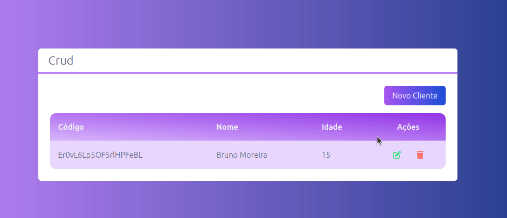

# Crud

Este é um projeto simples que permite cadastrar, atualizar e excluir clientes. O projeto utiliza as seguintes tecnologias:

- Tailwind CSS: um framework CSS utilizado para estilizar a aplicação
- Firebase/Firestore: um serviço de banco de dados em nuvem utilizado para armazenar e gerenciar os dados dos clientes

- Next.js: um framework para desenvolvimento web com React.js utilizado para criar o frontend da aplicação

----------

## Como funciona

A aplicação possui uma classe chamada ColecaoCliente que é responsável por realizar as operações de salvar, atualizar e excluir os clientes no banco de dados Firestore.

------

## Cadastro de Usuarios:


- Para salvar um cliente, basta preencher o formulário com as informações do cliente e clicar em "Salvar". 

---------

## Atualizar usuario:


-  Para atualizar um cliente, basta clicar no botão "Editar" correspondente ao cliente desejado, preencher o formulário com as novas informações e clicar em "Salvar". A aplicação irá atualizar as informações do cliente no banco de dados.

------------

## Deletar Usuario:



- Para excluir um cliente, basta clicar no botão "Excluir" correspondente ao cliente desejado. A aplicação irá remover o registro do cliente do banco de dados.
 

-----------


## Imagem do Firebase

A imagem abaixo é uma representação do banco de dados em nuvem do Firebase, utilizado para armazenar os dados dos clientes. 


----


## Como usar

Para iniciar a aplicação em modo de desenvolvimento, utilize o seguinte comando no terminal:

``` bash
npm run dev
```

---------


## Maior Desafio

Um dos desafios enfrentados durante o desenvolvimento da aplicação foi o carregamento dos dados para serem apresentados na tabela. A solução encontrada para isso foi a implementação do método obterTodos() na classe ColecaoCliente, como mostrado abaixo:

```js
async obterTodos() {
  const querySnapShot = await getDocs(collection(db, "listaClientes"))
  return querySnapShot.docs.map((doc) => ({...doc.data(), id: doc.id}))
}
```
O método obterTodos() utiliza a biblioteca Firebase/Firestore para consultar o banco de dados e retornar um array com todos os clientes registrados, contendo as informações de cada cliente e o seu respectivo ID.

Além disso, a função renderizarDados() foi implementada para exibir os dados na tabela, utilizando o array de clientes retornado pelo método obterTodos(). O código da função é mostrado abaixo:


```jsx   
function renderizarDados() {
  
  return props.clientes?.map((cliente, i) => (
    <tr
 
      className={`${
        i % 2 === 0
          ? "bg-purple-200 hover:bg-purple-100"
          : "bg-purple-300 hover:bg-purple-50"
      }`}
    >
      <td className="text-left p-4">{cliente.id}</td>
      <td className="text-left p-4">{cliente.nome}</td>
      <td className="text-left p-4">{cliente.idade}</td>

      {exibirAcoes ? renderizarAcoes(cliente) : false}
    </tr>
  ))
}
```

A função renderizarDados() utiliza o método map() para percorrer o array de clientes e gerar uma tabela com as informações de cada um. Além disso, ela utiliza a propriedade exibirAcoes para decidir se as ações de editar e excluir devem ser exibidas na tabela ou não.